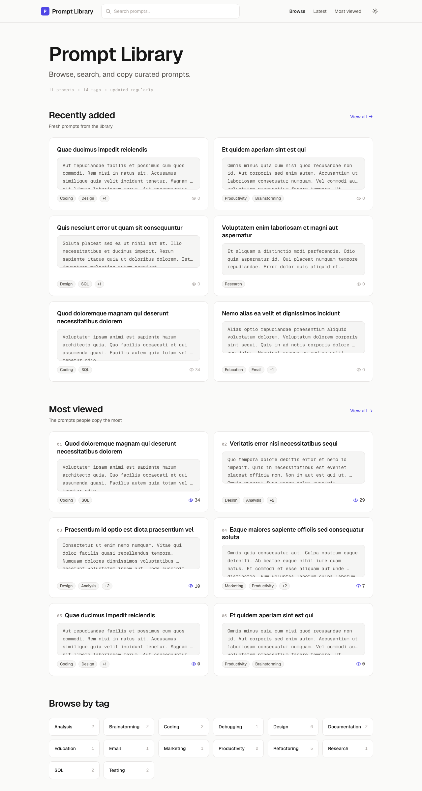
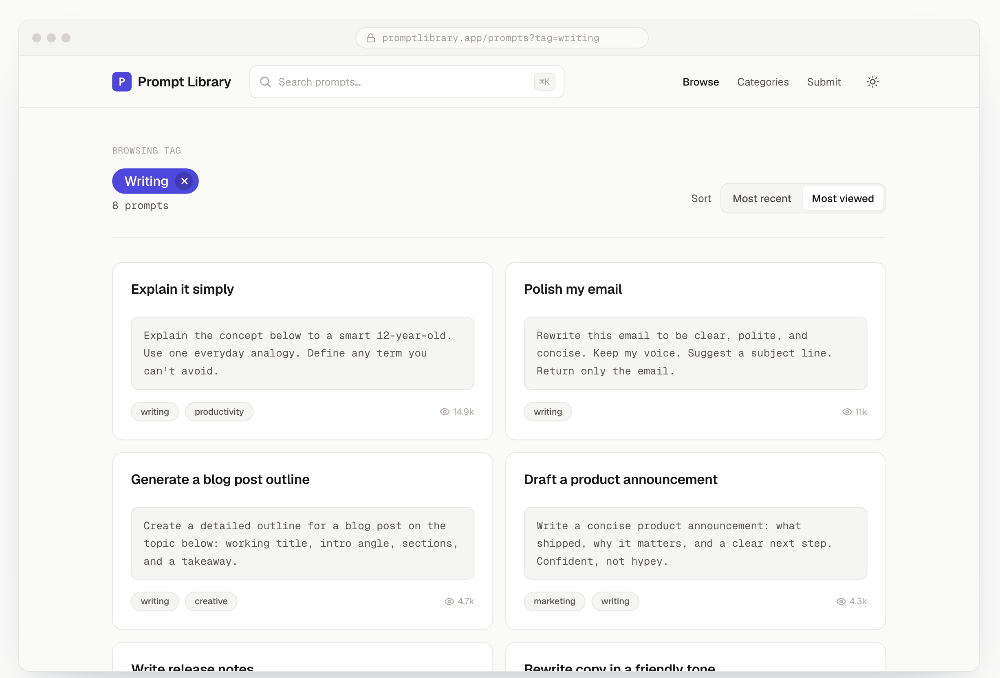
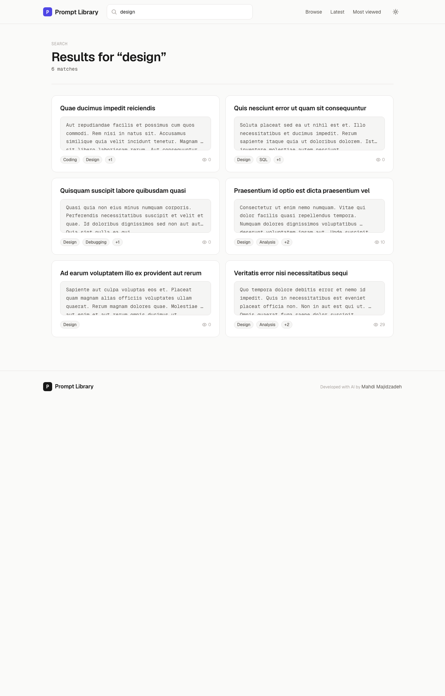

# Prompt Library

> A small, curated home for reusable prompts — fast to browse, easy to copy, light on its feet.



## What it is

Prompt Library is a public-facing catalog of carefully written prompts with a quiet admin back office for the maintainer. It's built to feel like a reading site, not a SaaS dashboard: typography-first, two-column layouts, a soft light/dark palette, and zero noise on the page.

A visitor can land on the home page, scan the latest and most-viewed prompts, jump into a tag, read a detail page, and copy the prompt — all without signing in. Behind the scenes, a single admin manages the catalog: writes prompts, tags them, toggles visibility, and forgets about everything else.

The project doubles as a small showcase of a modern Laravel stack: Livewire 3 for interactivity, Tailwind CSS 4 with `@theme` tokens, a denormalized view-counter folded asynchronously by a scheduled command, and a 30-minute HTTP cache on every public page.

## Highlights

- **Public reading experience, no sign-up.** Anyone can browse, search by title or tag, and copy. There is no public account system by design.
- **One-admin back office.** A seeded admin manages prompts and tags from a minimal, embedded admin panel that shares the same layout shell as the public site.
- **Tags, not categories.** Prompts carry zero-to-many tags. Tag pages and tag filters are first-class. Tags are never deleted — they're forever, so URLs stay stable.
- **Stable short URLs.** Prompt slugs are random 16-character strings, generated once at creation. Editing a title never breaks an existing link.
- **Deferred view counts.** Visiting a prompt records a deduplicated row; a 5-minute scheduled command folds those rows into a denormalized `view_count`. The "Most viewed" ordering is allowed to lag by a few minutes in exchange for zero write contention on the hot path.
- **30-minute browser cache** on every public page. Cache-aware out of the box: `Vary: Cookie` so embedded CSRF tokens stay session-scoped.
- **Single CSS file design system.** All tokens (color, type scale, spacing, motion) and all `pl-*` UI primitives live in one Tailwind 4 file. No `tailwind.config.js`. No bespoke CSS in Blade files.
- **Theme by attribute, not media query.** `data-theme="light|dark"` flips the entire palette; the user's choice persists in `localStorage`.

## A look around

### The home page

Three sections: the six most-viewed prompts (ranked), the six latest, and a grid of every tag that has at least one public prompt. The header doubles as a search bar.


### A prompt, in full

Reading a prompt is the whole point. The detail page is narrow, typographic, and quiet — the body is rendered in a monospace block so whitespace is preserved exactly. Tags and a small "related" rail sit underneath.


### Browse

The listing page uses infinite scroll with an `IntersectionObserver` sentinel. Twelve cards per page, lazy-loaded as you go. The same card primitive (`<x-prompt-card />`) is reused across home, latest, most-viewed, tag pages, and search.



### Search

Search matches on **title** and **tag name** — never on body. The `?q=` parameter round-trips, so a search URL is shareable. Empty query returns no results (rather than the full catalog).



## Under the hood

| Layer | Choice | Why |
| ----- | ------ | --- |
| Language | PHP 8.2+ | Modern syntax, native enums, readonly props. |
| Framework | Laravel 12 | Pragmatic batteries-included server framework. |
| Interactivity | Livewire 3 | Stateful server components — no separate API, no SPA build. |
| Styling | Tailwind CSS 4 | `@theme` tokens, `@layer components`, no JS config file. |
| Database | MySQL / MariaDB (SQLite for tests) | Standard relational store; tests run on in-memory SQLite for speed. |
| Asset build | Vite 7 | Fast dev HMR, hashed prod bundles. |
| Tests | PHPUnit 11 + Livewire test helpers | All feature tests; in-memory DB; `RefreshDatabase` per test. |

The whole app is around **1,300 lines of PHP** across models, Livewire components, one middleware, and one scheduled command. No controllers, no FormRequests, no service layer, no API — Livewire components own each page's logic; Eloquent owns the data layer.

## Notable engineering bits

- **`prompts:aggregate-views`** — an idempotent, incremental fold that snapshots the max id of uncounted view rows, groups by prompt, and bumps `prompts.view_count` per group inside a transaction. Survives concurrent inserts mid-run. See `app/Console/Commands/AggregatePromptViews.php`.
- **`CachePublicPage` middleware** — stamps `Cache-Control` and `Vary` on 200 GET/HEAD responses only; leaves errors, redirects, and POSTs untouched. See `app/Http/Middleware/CachePublicPage.php`.
- **`Prompt::scopePublic()`** — a single source of truth for the public/private boundary. Every public-facing query goes through it, and a dedicated test file (`tests/Feature/PublicScopeTest.php`) keeps that invariant honest.
- **Auto-slugged tags, random-slug prompts** — different strategies on purpose: tag slugs are SEO-friendly and derived from the name; prompt slugs are short stable random strings that survive renames.

## Getting started

The four-step version is below. For the full developer workflow — env vars, scheduler, dev commands, troubleshooting — see [`_context/10-dev-workflow.md`](./_context/10-dev-workflow.md).

```bash
composer install && npm install
cp .env.example .env && php artisan key:generate
# Set ADMIN_EMAIL and ADMIN_PASSWORD in .env, configure your DB
php artisan migrate:fresh --seed && npm run build
php artisan serve
```

Sign in as the seeded admin at `/login`.

## Project docs

The [`_context/`](./_context/) folder is an onboarding pack — short topical docs that map every part of the codebase, cross-link source files by `path:line`, and call out conventions and intentional absences. Start at [`_context/README.md`](./_context/README.md).

Adjacent references:

- [`DESIGN-MAP.md`](./DESIGN-MAP.md) — maps each Blade page back to its `claude-design/*.html` source.
- [`prompt-library-requirements.md`](./prompt-library-requirements.md) — original product requirements (historical).
- [`claude-design/`](./claude-design/) — original HTML mockups (Home, Prompts, Detail).

## Credits

Built by [Mahdi Majidzadeh](https://mahdi.majidzadeh.ir/) with the help of Claude.
